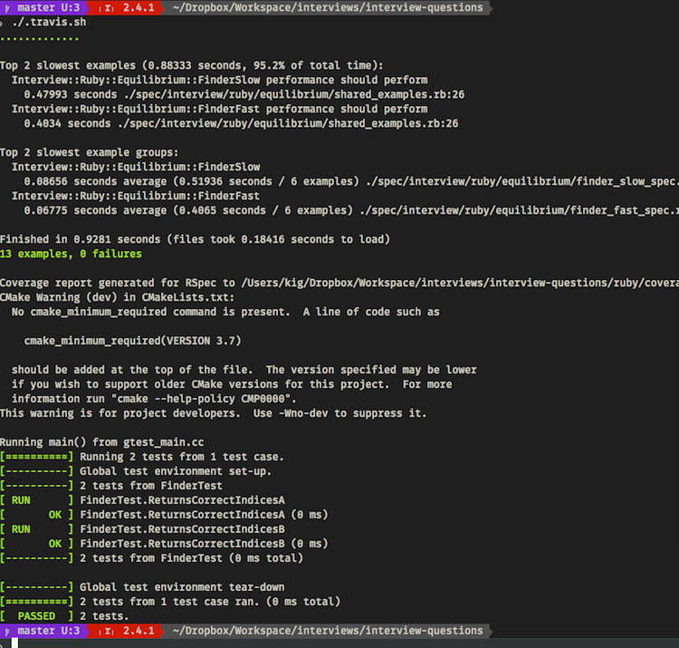

[](https://travis-ci.org/kigster/algorithmic-exercises)
[](https://codeclimate.com/github/kigster/algorithmic-exercises/coverage)
[](https://codeclimate.com/github/kigster/algorithmic-exercises)
[](https://codeclimate.com/github/kigster/algorithmic-exercises)

# A Collection of Interview Questions & Solutions, in Ruby and C++

## Various questions and answers for interview coding challenges.

This repo contains a collection of interview questions and challenges implemented in ruby and C/C++.

There are two subfolders — `cpp/` and `ruby/`. 

They are completely independent, but a top-level build script called `/.travis.sh` contains the steps to run the ruby test suite, as well as the C/C++ sweet as well.

```bash
git clone https://github.com/kigster/algorithmic-exercises 
cd algorithmic-exercises
```

And then, you can run `./.travis.sh`:


<a href="doc/test-suite.png" target="_blank" style="text-align: center; width: 100%; display: block; padding: 20px;" ></a>

View the contents of that shell script for specifics on building each portion of the repo.

## Contributing

Bug reports and pull requests are very welcome. 

Please submit [pull requests](https://github.com/kigster/algorithmic-exercises).

## License

The gem is available as open source under the terms of the [MIT License](http://opensource.org/licenses/MIT).
